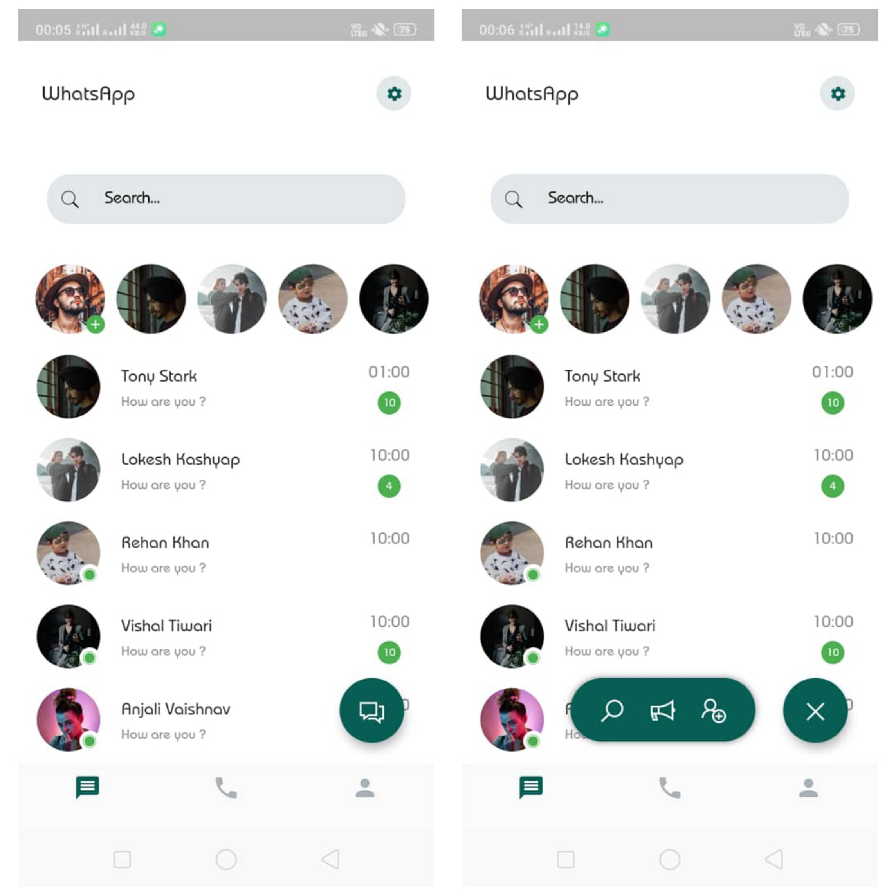
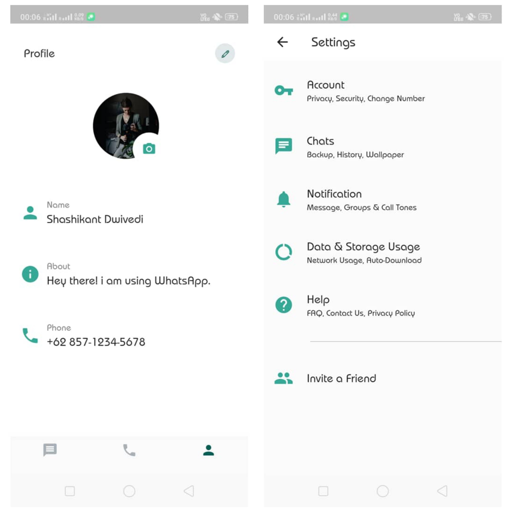
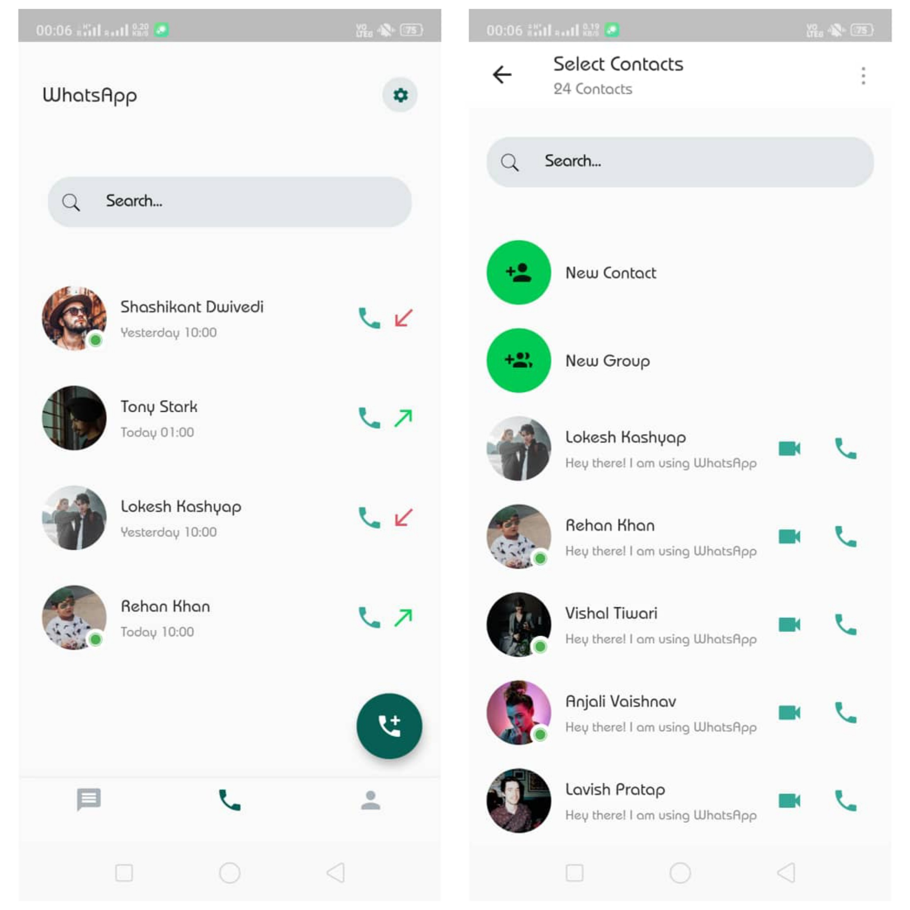
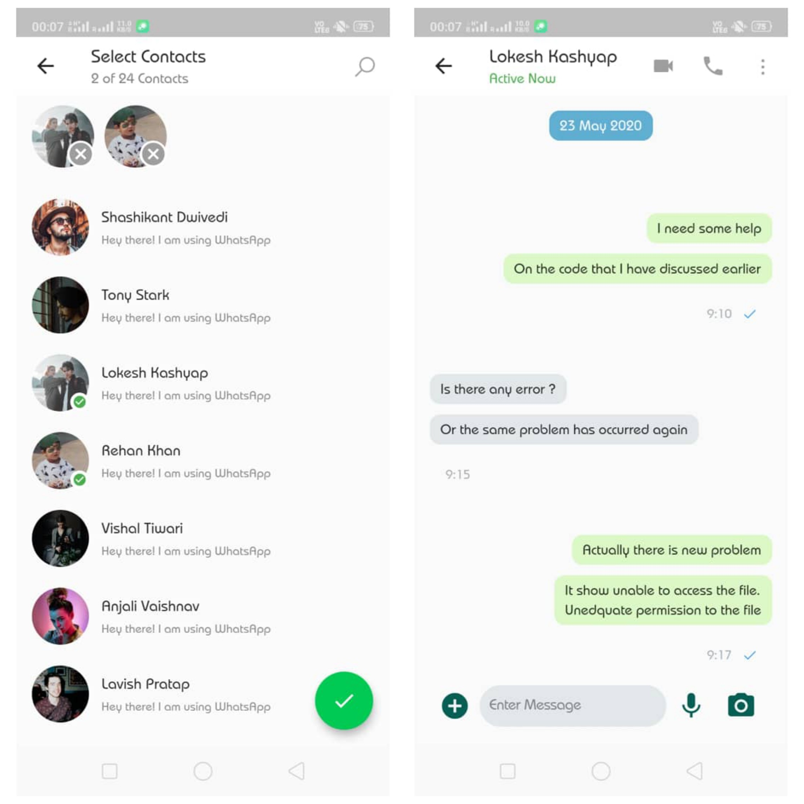

   

<!-- PROJECT LOGO -->
 

  

  <h3 align="center">WhatsApp Redesign UI</h3>

  

    A new design concept for whatsapp.
     
  

<!-- TABLE OF CONTENTS -->

## Table of Contents

* [About the Project](#about-the-project)
  * [Built With](#built-with)
* [Contact](#contact)
* [Acknowledgements](#acknowledgements)

<!-- ABOUT THE PROJECT -->
## About The Project

## 

## 

## 

This application shows a WhatsApp UI Redesign Concept.

### Built With
* [Dart](https://dart.dev)
* [Flutter](https://flutter.dev)

<!-- GETTING STARTED -->

## Contact

Shashikant Dwivedi - [@theskd1999](https://twitter.com/theskd1999) - shashikant@shashikantdwivedi.com

Project Link: [https://github.com/shashikantdwivedi/Flutter-WhatsApp-UI-Redesign](https://github.com/shashikantdwivedi/Flutter-WhatsApp-UI-Redesign)

<!-- ACKNOWLEDGEMENTS -->
## Acknowledgements
* [font_awesome_icons](https://pub.dev/packages/line_awesome_icons)
* [provider](https://pub.dev/packages/provider)
